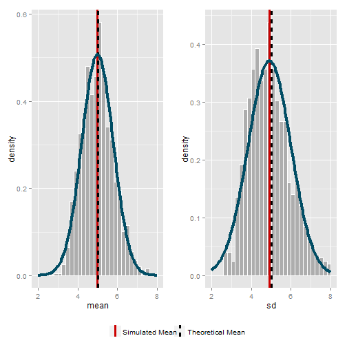

*Assignment completed as component of the [Statistical Inference](https://www.coursera.org/course/statinference) course offered by the Johns Hopkins Bloomberg School of Public Health through Coursera.*

# Introduction

The exponential distribution can be simulated in R with `rexp(n, lambda)` where lambda is the rate parameter. The mean of exponential distribution is $\frac{1}{\lambda}$ and the standard deviation is also also $\frac{1}{\lambda}$ (where $\lambda$ is represented by "lambda"). 

With $\lambda = 0.2$ for all simulations, we investigate the distribution of averages of 40 instances of the exponential function. To accomplish this, we perform a thousand or so simulated averages of 40 exponentials.

Through the simulation and associated explanatory text, we illustrate the properties of the distribution of the mean of 40 exponential(0.2) instances while aiming to:

1. Show where the distribution is centered at and compare it to the theoretical center of the distribution.
2. Show how variable it is and compare it to the theoretical variance of the distribution.
3. Show that the distribution is approximately normal.

# Simulation

First, the following code executes 1000 trials of 40 exponentially distributed random variables with $\lambda = 0.2$ and stores the sample mean, $\bar{x}$, and the sample standard deviation, $\sigma_{\bar{x}}$, as rows in separate lists, `mean` and `sd`, respectively. 


```r
set.seed(0)
simulations <- 1000
n <- 40
lambda <- 0.2

mean <- as.numeric(list())
sd <- as.numeric(list())

for (i in 1 : simulations) {
        temp <- rexp(n, lambda)
        mean[i] <- mean(temp)
        sd[i] <- sd(temp)
}

df <- as.data.frame(cbind(mean,sd))
colnames(df) <- c("mean", "sd")
```

These two lists are combined into a data frame, `df`, with each row containing the $\bar{x}$ and $\sigma_{\bar{x}}$ for one of the 1000 trials. This data frame forms the basis for the next stage of analysis.


# Analysis

Using the variables captured, we can now analyze the various properties of the simulated values visually and quantitatively. We first summarize the data with a plot and table.

### Plot 1: Theoretical and Measured Simulation Results

 

### Table 1: Theoretical and Measured Plot Properties

| Measure | Value for Sampled Means Set  |  Value for Sampled Standard Deviations Set  | 
|:-------:|-------:|-------:|
| $\mu$       | 5    | 5    | 
| $\bar{x}$   | 4.9896776     | 4.912791     |
| $\sigma$       | 0.7905694    |  0.7905694    | 
| $\sigma_{\bar{x}}$  | 0.7862304     | 1.0724647     |

## Comparison of Theoretical and Simulation Center of Distribution


The theoretical center of distribution of the dataset, $\mu$, is, by the definition of the exponential function, $\frac{1}{\lambda}$, which is $\frac{1}{0.2} = 5$ in this case. The $\bar{x}$ of the means stored in `simulation.mean.mean` is ~4.9897. As shown on the plot of the values, $\mu$ and $\bar{x}$ are almost identical given the simulation data.

### Normal Distribution of Center of Distribution

Assuming a distribution following the Central Limit Theorem, we can expect a normal distribution of $\sigma = \frac{\mu}{\sqrt{n}}$ (where $n$ is the number of instances per trial) centered around $\mu$. As such, we would expect that the $\sigma_{\bar{x}}$ of the means would be close to $\frac{5}{\sqrt{40}}$ (~0.7906) if the distribution were normally distributed. As the $\sigma_{\bar{x}}$ stored in `simulation.sd.mean` is ~0.7862, we can asssume that the means are approximately normally distributed because of the CLT.

## Comparison of Theoretical and Simulation Variability of Distribution

The $\mu$ of the theoretical variability of the dataset, $\sigma$, is also, $\frac{1}{\lambda}$, which is $\frac{1}{0.2} = 5$. The $\bar{x}$ of the sampled standard deviations stored in `simulation.sd.mean` is 4.912791. As shown on the plot of the values, $\mu$ and $\bar{x}$ for the standard deviation valuers are almost identical given the simulation data.

### Normal Distribution of Variability

Assuming a distribution following the Central Limit Theorem, we can similarly expect a normal distribution of the observed standard deviations of $\frac{\mu}{\sqrt{n}}$ centered around the expected $\sigma$, 5. As such, we would expect that the $\sigma_{\bar{x}}$ of the standard deviations would be close to $\frac{5}{\sqrt{40}}$ (~0.7906) if the distribution were normally distributed. As the $\sigma_{\bar{x}}$ stored in `simulation.sd.mean` is ~1.0725, we can asssume that the means are approximately normally distributed because of the CLT (albeit less obviously than for the distribution of the centers of distribution).
